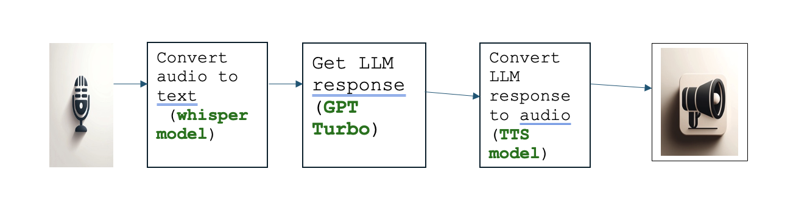

# Audio chatbot Architecture

# Install libraries 

pip install -r streamlit_audio_app_requirements.txt

# set up environment variables

export open_ai_secret_key = abc 

# How to run the app

streamlit run streamlit_audio_app.py

# Speak to the app using laptop mic 

Press the microphone button to speak to the app.

# Wait for the response from the app

Ask questions about any topic using the microphone.

Press playback button to hear the response from the app.

# sample output

